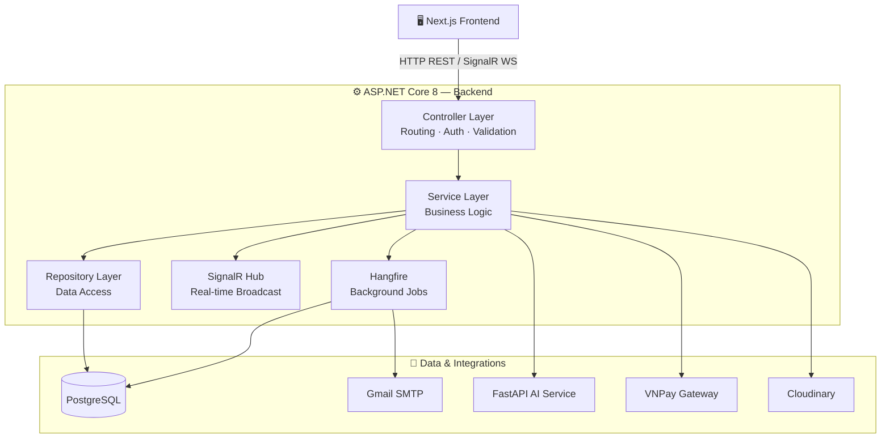
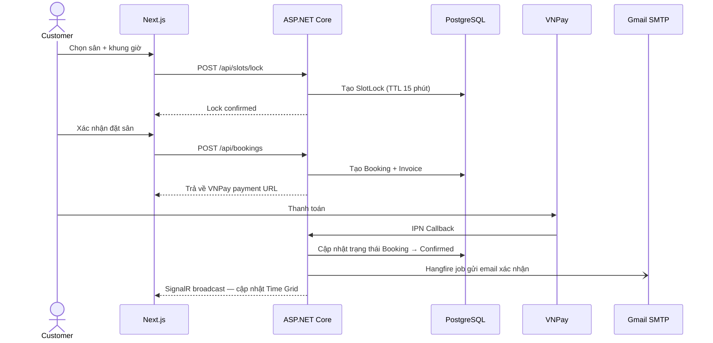
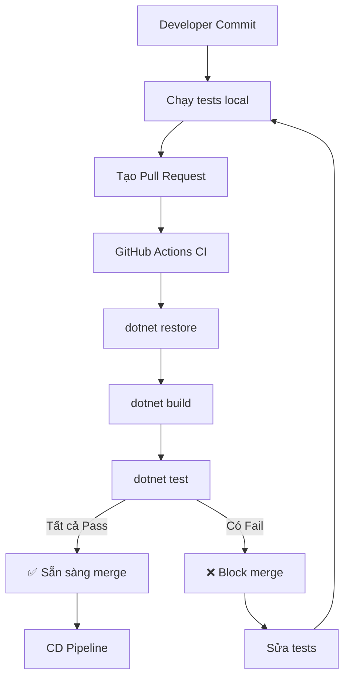
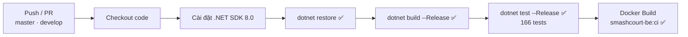

# SmashCourt — Backend (BE) ⚙️

[](https://dotnet.microsoft.com/)
[](https://www.postgresql.org/)
[](https://github.com/NguyenThanhTrung-N2T/SmashCourt-BE/actions)
[](https://github.com/NguyenThanhTrung-N2T/SmashCourt-BE)
[](https://xunit.net/)
[](https://github.com/moq/moq4)
[](https://www.hangfire.io/)
[](https://learn.microsoft.com/aspnet/core/signalr/)
[](https://www.docker.com/)
[](https://opensource.org/licenses/MIT)
[](https://github.com/NguyenThanhTrung-N2T/SmashCourt-BE/actions)

> Hệ thống xử lý nghiệp vụ, cung cấp REST API hiệu năng cao, điều phối tác vụ thời gian thực và quản lý tác vụ nền cho Hệ thống Quản lý và Đặt Sân Cầu Lông **SmashCourt**. Được xây dựng trên nền tảng **ASP.NET Core 8** với kiến trúc phân tầng (Layered Architecture).

---

## 🌐 Hệ sinh thái dự án (Project Ecosystem)

SmashCourt được chia làm **3 phân hệ độc lập**, mỗi phân hệ là một repository riêng để tối ưu hóa khả năng phát triển song song và triển khai độc lập:

| Phân hệ | Công nghệ | Repository |
| :--- | :--- | :--- |
| 🖥️ **Frontend (FE)** | Next.js 16, React 19, TailwindCSS v4 | [SmashCourt-FE](https://github.com/NguyenThanhTrung-N2T/SmashCourt-FE) |
| ⚙️ **Backend (BE)** ← *Bạn đang ở đây* | ASP.NET Core 8, SignalR, Hangfire, PostgreSQL | [SmashCourt-BE](https://github.com/NguyenThanhTrung-N2T/SmashCourt-BE) |
| 🤖 **AI Service** | FastAPI, Python 3.12, Google Gemini API | [SmashCourt-AI](https://github.com/NguyenThanhTrung-N2T/SmashCourt-AI) |

---

## 📌 Giới thiệu (Introduction)

**SmashCourt Backend** là trung tâm điều hành của toàn bộ hệ thống. Phân hệ này chịu trách nhiệm:

- **Xác thực & Phân quyền**: JWT Access Token + Refresh Token rotation, Google OAuth 2.0, xác thực 2 bước qua OTP email.
- **REST API**: Cung cấp toàn bộ API nghiệp vụ cho Frontend thông qua **ASP.NET Core 8 Web API** + **Entity Framework Core** (code-first).
- **Real-time**: Quản lý kết nối WebSocket qua **SignalR Hub** — phát sóng cập nhật trạng thái sân, thông báo hệ thống tức thời đến tất cả client đang kết nối.
- **Background Processing**: Hàng đợi tác vụ nền và lập lịch tự động qua **Hangfire** — gửi email, dọn dẹp booking hết hạn, cập nhật trạng thái khuyến mãi.
- **AI Gateway**: Đóng vai trò proxy an toàn cho mọi yêu cầu AI từ Frontend đến **FastAPI AI Service** — đảm bảo không lộ endpoint AI ra bên ngoài.
- **Third-party Integrations**: VNPay (thanh toán), Cloudinary (lưu trữ ảnh), Gmail SMTP (gửi email).

---

## 🚀 Tính năng cốt lõi (Key Features)

### 1. Quản lý Booking & Chống xung đột (Concurrency Control)

| Tính năng | Mô tả |
| :--- | :--- |
| **Time Grid API** | Trả về trạng thái toàn bộ slot theo chi nhánh, loại sân và ngày. |
| **Slot Lock** | Khóa slot tạm thời (có TTL) khi khách đang trong quá trình thanh toán — ngăn double-booking. |
| **Slot Interest** | Khách đăng ký theo dõi slot, hệ thống tự động thông báo khi slot đó được giải phóng. |
| **Booking Pipeline** | Tính giá tự động: giá sân + dịch vụ + loyalty discount + promotion — validate đồng bộ toàn bộ điều kiện. |

### 2. Tác vụ nền tự động (Hangfire Jobs)

| Job Type | Tác vụ | Trigger |
| :--- | :--- | :--- |
| Fire-and-forget | Gửi email xác nhận booking | Khi booking được tạo |
| Fire-and-forget | Gửi email hủy booking & thông báo hoàn tiền | Khi booking bị hủy |
| Recurring | Tự động hủy booking chưa thanh toán quá 15 phút | Mỗi 5 phút |
| Recurring | Cập nhật trạng thái khuyến mãi hết hạn/hết lượt | Mỗi giờ |
| Recurring | Dọn dẹp OTP code và Slot Lock hết hạn | Mỗi ngày |

### 3. Tích hợp dịch vụ bên thứ ba

| Dịch vụ | Mục đích |
| :--- | :--- |
| **VNPay** | Tạo link thanh toán, xử lý Return URL & IPN callback, ghi log đối soát |
| **Google OAuth 2.0** | Đăng nhập bằng tài khoản Google |
| **Cloudinary** | Upload và lưu trữ ảnh chi nhánh, sân, avatar người dùng |
| **Gmail SMTP** | Gửi email OTP, xác nhận booking, thông báo hủy |
| **FastAPI AI Service** | Proxy toàn bộ yêu cầu AI (chatbot, gợi ý, analytics) |

---

## 📐 Kiến trúc tổng quan (Overall Architecture)

### Phân tầng hệ thống



### Luồng xử lý Booking (Sequence)



---

## 🛠️ Hướng dẫn cài đặt (Installation)

### Yêu cầu hệ thống (Prerequisites)

| Công cụ | Phiên bản tối thiểu | Ghi chú |
| :--- | :--- | :--- |
| [.NET SDK](https://dotnet.microsoft.com/download) | `8.0` trở lên | Bắt buộc |
| [PostgreSQL](https://www.postgresql.org/) | `15+` | Cơ sở dữ liệu chính |
| [Git](https://git-scm.com/) | Bất kỳ | Để clone dự án |
| [Docker](https://www.docker.com/) | Bất kỳ | Tùy chọn — để chạy container |

### Clone và cài đặt

```bash
# 1. Clone repository
git clone https://github.com/NguyenThanhTrung-N2T/SmashCourt-BE.git

# 2. Di chuyển vào thư mục dự án
cd SmashCourt-BE

# 3. Khôi phục các gói NuGet
dotnet restore
```

---

## ▶️ Khởi chạy dự án (Running the Project)

### Development Server (Local)

```bash
dotnet run
```

Sau khi khởi động, các endpoint có sẵn:

| Endpoint | Mô tả |
| :--- | :--- |
| `http://localhost:5000/swagger` | Swagger UI — Tài liệu & kiểm thử API tương tác |
| `http://localhost:5000/hangfire` | Hangfire Dashboard — Theo dõi và quản lý background jobs |
| `ws://localhost:5000/hubs/...` | SignalR Hub endpoint |

### Áp dụng Database Migrations

```bash
# Cập nhật database lên schema mới nhất
dotnet ef database update

# Tạo migration mới (khi thay đổi model)
dotnet ef migrations add MigrationName
```

### Khởi chạy với Docker Compose

```bash
docker compose up -d --build
```

> 💡 File `docker-compose.yml` bao gồm cấu hình **ngrok** (dạng comment) để expose API ra internet — hữu ích khi cần test VNPay IPN Callback hoặc Google OAuth redirect từ môi trường local.

---

## ⚙️ Cấu hình môi trường (Env Configuration)

```bash
# Sao chép file mẫu
cp .env.example .env
```

Sau đó điền các giá trị thực vào file `.env`:

```env
# ── ASP.NET Core ──────────────────────────────────
ASPNETCORE_ENVIRONMENT=Development

# ── Database ──────────────────────────────────────
ConnectionStrings__DefaultConnection=Host=localhost;Port=5432;Database=smashcourt;Username=postgres;Password=your_password

# ── JWT Authentication ────────────────────────────
Jwt__SecretKey=your_super_secret_key_at_least_32_chars
Jwt__Issuer=SmashCourt
Jwt__Audience=SmashCourtUsers

# ── Google OAuth ──────────────────────────────────
Google__ClientId=your_google_client_id
Google__ClientSecret=your_google_client_secret

# ── VNPay ─────────────────────────────────────────
VNPay__TmnCode=YOUR_TMNCODE
VNPay__HashSecret=your_hash_secret
VNPay__BaseUrl=https://sandbox.vnpayment.vn/paymentv2/vpcpay.html

# ── Cloudinary ────────────────────────────────────
Cloudinary__CloudName=your_cloud_name
Cloudinary__ApiKey=your_api_key
Cloudinary__ApiSecret=your_api_secret

# ── Gmail SMTP ────────────────────────────────────
Smtp__Host=smtp.gmail.com
Smtp__Port=587
Smtp__Username=your_email@gmail.com
Smtp__Password=your_app_password

# ── AI Service ────────────────────────────────────
AIService__BaseUrl=http://localhost:8000
```

Bảng tóm tắt các biến quan trọng:

| Biến | Bắt buộc | Mô tả |
| :--- | :---: | :--- |
| `ConnectionStrings__DefaultConnection` | ✅ | Chuỗi kết nối PostgreSQL |
| `Jwt__SecretKey` | ✅ | Khóa bí mật ký JWT (tối thiểu 32 ký tự) |
| `VNPay__TmnCode` & `HashSecret` | ✅ (production) | Thông tin merchant VNPay |
| `Google__ClientId` & `ClientSecret` | ✅ (OAuth) | Thông tin ứng dụng Google Cloud Console |
| `Cloudinary__*` | ✅ | Thông tin tài khoản Cloudinary |
| `AIService__BaseUrl` | ✅ | URL kết nối đến FastAPI AI Service |

---

## 📂 Cấu trúc thư mục (Folder Structure)

```
SmashCourt-BE/
│
├── Controllers/               # API Controllers — Routing & HTTP endpoints
│   ├── AuthController.cs
│   ├── BookingController.cs
│   ├── PaymentController.cs
│   └── ...
│
├── Services/                  # Business Logic Layer
│   ├── BookingService.cs
│   ├── PaymentService.cs
│   ├── LoyaltyService.cs
│   └── ...
│
├── Repositories/              # Data Access Layer — EF Core queries
│
├── Models/                    # Database Entities (EF Core code-first)
│
├── DTOs/                      # Data Transfer Objects — Request/Response shapes
│
├── Data/                      # DbContext, Model Configurations, Seeders
│
├── Migrations/                # EF Core Database Migrations history
│
├── Hubs/                      # SignalR Hubs — Real-time WebSocket endpoints
│   └── BookingHub.cs
│
├── Jobs/                      # Hangfire Job definitions
│   ├── EmailJob.cs
│   ├── BookingCleanupJob.cs
│   └── PromotionSyncJob.cs
│
├── Integrations/              # Third-party service clients
│   ├── VNPayService.cs
│   ├── CloudinaryService.cs
│   └── SmtpService.cs
│
├── Middlewares/               # Custom Middleware (Error handling, Rate limiting)
│
├── Infrastructure/            # JWT config, Auth policies, Logging setup
│
├── Configurations/            # Options classes (strongly-typed config)
│
├── Helpers/                   # Extension methods, utility functions
│
├── Templates/                 # Email HTML templates
│
├── Program.cs                 # App entry point — DI registration & middleware pipeline
├── appsettings.json           # Base configuration
├── appsettings.Development.json
├── SmashCourt-BE.csproj       # Project file & NuGet dependencies
├── Dockerfile                 # Multi-stage Docker build
└── docker-compose.yml         # Docker Compose (API + ngrok optional)
```

---

## 🧪 Bộ kiểm thử & Đảm bảo chất lượng (Test Suite & Quality Assurance)

### Tổng quan

SmashCourt Backend được bảo vệ bởi một **bộ kiểm thử toàn diện** với **236 tests** (235 unit tests + 1 integration test) sử dụng **xUnit**, **Moq** và **Testcontainers**.

```
📊 Thống kê kiểm thử:
├── Unit Tests:         235 passed ✅
├── Integration Tests:  1 passed ✅ (Testcontainers PostgreSQL)
├── Total Tests:        236 / 236 passed (100%)
├── Thời gian chạy:     ~30 giây (bao gồm khởi động Docker containers)
├── Framework:          xUnit 3.1.4 + Moq 4.20 + Testcontainers
└── CI/CD:              Tự động chạy trên mọi PR/push qua GitHub Actions
```

**Chiến lược test:** Ưu tiên kiểm thử service layer với unit tests nhanh và hiệu quả. Integration tests sử dụng Testcontainers để đảm bảo tương thích database PostgreSQL thực tế.

### Phạm vi kiểm thử

#### Độ phủ theo module

```
┌─────────────────────────────────────────────────────────────────┐
│ Chi tiết độ phủ theo module                                     │
├─────────────────────────────────────────────────────────────────┤
│                                                                 │
│ PromotionEngineService ████████████████████░ 96% (42 tests)    │
│ LoyaltyService         ████████████████████░ 100% (14 tests)   │
│ OtpService             ████████████████████░ 100% (10+ tests)  │
│ AuthService            ██████████████████░░░ 90% (20 tests)    │
│ EmailService           █████████████████░░░░ 85% (10+ tests)   │
│ PaymentService         ████████████████░░░░░ 80% (15 tests)    │
│ BookingService         ███████████░░░░░░░░░░ 60% (63 tests)    │
│ Other Services         ██████████░░░░░░░░░░░ 50% (60+ tests)   │
│                                                                 │
│ Integration Tests      █░░░░░░░░░░░░░░░░░░░░ Infrastructure OK │
│                                                                 │
└─────────────────────────────────────────────────────────────────┘
```

#### Ma trận độ phủ chi tiết

| Service | Tests | Phạm vi kiểm thử | Trạng thái |
| :--- | ---: | :--- | :---: |
| **PromotionEngineService** | 42 | Validation, discount calculation, conditions | ✅ Complete |
| **LoyaltyService** | 14 | Tier logic, transactions, progress | ✅ Complete |
| **OtpService** | 10+ | Generation, validation, expiry | ✅ Complete |
| **AuthService** | 20 | Login, 2FA, token management | ✅ Core done |
| **EmailService** | 10+ | SMTP, templates, error handling | ✅ Core done |
| **PaymentService** | 15 | VNPay integration, IPN, refunds | ✅ Critical paths |
| **BookingService** | 63 | Create, checkout, cancel, services | 🔄 Major coverage |
| **BranchPriceService** | 5 | Price resolution, overrides | 🟡 Basic |
| **CourtService** | 4 | CRUD operations | 🟡 Basic |
| **SystemPriceService** | 8 | Time slot pricing | 🟡 Partial |
| **Other Services** | 30+ | Various business logic | 🟡 Varies |
| **Helpers & DTOs** | 20+ | Utilities, validators | ✅ Good |
| **Integration** | 1 | PostgreSQL connectivity | ✅ Smoke test |

### Các luồng nghiệp vụ đã được kiểm thử

#### 🎯 Các thành tựu chính

```
✅ Promotion Engine         → 96% (42 tests - full condition logic)
✅ Loyalty System           → 100% (14 tests - tier progression complete)
✅ OTP Service              → 100% (10+ tests - security verified)
✅ Auth Core Paths          → 90% (20 tests - login, 2FA, token refresh)
✅ Email Service            → 85% (10+ tests - SMTP abstraction)
✅ Payment Integration      → 80% (15 tests - VNPay IPN, refunds)
✅ Booking Workflow         → 60% (63 tests - create, checkout, cancel)
✅ Integration Tests        → Infrastructure validated với Testcontainers
```

#### ✅ Promotion Engine (42 tests - 96% coverage)
- **Validation điều kiện**: MIN_BOOKING_AMOUNT, MAX_PREVIOUS_BOOKINGS, BRANCH_ID
- **Điều kiện thời gian**: DAY_OF_WEEK, START_HOUR, END_HOUR, MONTH, SPECIFIC_DATES
- **Tính giảm giá**: Percentage, fixed amount, max discount cap
- **Edge cases**: Invalid formats, unknown conditions, multiple conditions
- **Usage management**: Atomic increment/decrement operations

#### ✅ Loyalty System (14 tests - 100% coverage)
- **GetMyLoyaltyAsync**: Tier calculation, progress percentage, next tier info
- **GetMyTransactionsAsync**: Pagination, booking code mapping, points history
- **Tier logic**: Bronze → Silver → Gold transitions với boundary tests
- **Edge cases**: Max tier, zero points, boundary conditions

#### ✅ OTP Service (10+ tests - 100% coverage)
- **Generation**: 6-digit codes, HMAC signing, expiry handling
- **Validation**: Valid/invalid/expired OTP paths
- **Security**: Hash verification, HMAC secret validation
- **Edge cases**: Missing config, invalid formats, replay attacks

#### ✅ Quản lý Booking (63 tests - 60% coverage)
- **Đặt sân online/walk-in**: Validation, tính giá, slot lock, kiểm soát đồng thời
- **Checkout**: Luồng UNPAID/PARTIALLY_PAID/PAID, cập nhật nhiều sân cùng lúc
- **Check-in**: Validation khung giờ, từ chối sớm/muộn, luồng thành công
- **Hủy sân**: Hủy bởi nhân viên/khách hàng, tính toán hoàn tiền, áp dụng chính sách
- **Quản lý dịch vụ**: Thêm/xóa dịch vụ, tăng số lượng atomic, tính lại hóa đơn
- **Guard clauses**: Validate trạng thái, quyền truy cập chi nhánh, ngăn double-checkout

#### ✅ Xử lý Thanh toán (15 tests - 80% coverage)
- **Tích hợp VNPay**: Validate chữ ký IPN, xử lý success/failure/duplicate callbacks
- **Thử lại thanh toán**: Validate quyền sở hữu, kiểm tra hết hạn, void payment cũ
- **Return URL**: Luồng success/cancelled/chữ ký không hợp lệ
- **Bảo mật**: Phát hiện số tiền không khớp, ngăn chặn signature forgery
- **Idempotency**: Xử lý IPN trùng lặp, không xử lý 2 lần, state mutation protection

#### ✅ Xác thực & Phân quyền (20 tests - 90% coverage)
- **Luồng đăng nhập**: Validate mật khẩu, khóa tài khoản sau 5 lần sai, khởi tạo 2FA
- **Quản lý token**: Validate refresh token, xử lý hết hạn, token rotation
- **Security guards**: Ưu tiên MustChangePassword, giới hạn thử OTP (3 attempts)
- **OAuth**: Validate đăng nhập Google, account linking
- **Edge cases**: Email chưa verify, tài khoản bị khóa, wrong password scenarios

#### ✅ Email Service (10+ tests - 85% coverage)
- **Template rendering**: OTP emails (register, forgot password, 2FA)
- **SMTP abstraction**: Configuration validation, error handling
- **Missing config**: Graceful degradation khi thiếu SMTP settings

#### ✅ Integration Tests (1 test - Infrastructure OK)
- **PostgreSQL Smoke Test**: Sử dụng Testcontainers để spin up PostgreSQL container
- **Basic CRUD**: Verify có thể persist và read TimeSlot entity
- **Infrastructure validation**: Đảm bảo migration scripts và enum mappings hoạt động đúng

### Chạy tests

```bash
# Chạy toàn bộ 236 tests (unit + integration)
dotnet test

# Chạy chỉ unit tests (không cần Docker - nhanh hơn)
dotnet test --filter "Category!=Integration"

# Chạy integration tests (yêu cầu Docker Desktop đang chạy)
dotnet test --filter "Category=Integration"

# Chạy tests với coverage report (sử dụng Coverlet)
dotnet test /p:CollectCoverage=true /p:CoverletOutputFormat=cobertura

# Chạy tests cho service cụ thể
dotnet test --filter "FullyQualifiedName~BookingServiceTests"

# Chạy tests với verbosity cao (để debug)
dotnet test --logger "console;verbosity=detailed"

# Liệt kê tất cả tests mà không chạy
dotnet test --list-tests
```

**Lưu ý khi chạy Integration Tests:**
- Cần Docker Desktop đang chạy (Testcontainers sẽ tự động pull PostgreSQL image)
- Integration tests mất ~20-25 giây để khởi động containers
- Tests sẽ tự động cleanup containers sau khi chạy xong

# Chạy tests với verbosity cao (debug)
dotnet test --logger "console;verbosity=detailed"
```

### Cấu trúc Test Project

```
SmashCourt-BE.Tests/
│
├── Services/                      # Unit tests các Service classes (235 tests)
│   ├── BookingServiceTests.cs     # 63 tests - Booking workflow
│   ├── PromotionEngineServiceTests.cs  # 42 tests ✅ 96% coverage
│   ├── AuthServiceTests.cs        # 20 tests ✅ 90% coverage
│   ├── LoyaltyServiceTests.cs     # 14 tests ✅ 100% coverage
│   ├── PaymentServiceTests.cs     # 15 tests - VNPay integration
│   ├── OtpServiceTests.cs         # 10+ tests ✅ 100% coverage
│   ├── EmailServiceTests.cs       # 10+ tests - SMTP
│   └── ...                        # 30+ other service test files
│
├── Helpers/                       # Tests cho Helper utilities
│   ├── AppExceptionAssertions.cs  # Custom assertions
│   ├── BookingStatusTransitionTests.cs  # Status FSM validation
│   ├── PromotionHelperTests.cs    # Discount calculation
│   └── DateAndSecurityHelperTests.cs  # DateTime, HMAC utilities
│
├── DTOs/                          # DTO validation tests
│   └── BookingDtoValidationTests.cs  # Custom validation rules
│
├── Integration/                   # Integration tests (1 test)
│   ├── PostgreSqlIntegrationFixture.cs   # Testcontainers setup
│   ├── IntegrationTestBase.cs           # Base với transaction isolation
│   ├── IntegrationTestCollection.cs     # xUnit collection
│   ├── TestDataSeeder.cs                # Seed helper
│   └── PostgreSqlSmokeTests.cs          # 1 test ✅ infrastructure OK
│
├── TestData/                      # Test infrastructure
│   ├── TestDataFactory.cs         # Entity factories với smart defaults
│   ├── TestUserFactory.cs         # User/role factories
│   ├── BookingServiceTestBuilder.cs  # Builder pattern (20+ dependencies)
│   └── TestConstants.cs           # Shared constants
│
└── SmashCourt-BE.Tests.csproj     # Test project file (xUnit, Moq, Testcontainers)
```

### Tiêu chuẩn chất lượng Test

Tất cả tests trong dự án tuân thủ các tiêu chuẩn sau:

#### 📏 Quy ước đặt tên
```csharp
[Fact]
public async Task {Method}_When{Scenario}_{ExpectedResult}()

// Ví dụ:
CheckoutAsync_WhenInvoiceIsUnpaid_CollectsFullAmountAndMarksInvoicePaid()
AddServiceAsync_WhenStatusChangesDuringTransaction_ThrowsBadRequestWithoutMutation()
```

#### ✅ Verification toàn diện
```csharp
// 1. Verify kết quả/trạng thái
Assert.Equal(expectedStatus, actualStatus);

// 2. Verify tác động phụ (positive)
repository.Verify(x => x.UpdateAsync(entity), Times.Once);

// 3. Verify không có tác động ngoài ý muốn (negative)
repository.Verify(x => x.CreateAsync(...), Times.Never);
```

#### 🏗️ Hạ tầng Test
- **Builder Pattern**: `BookingServiceTestBuilder` cho setup phức tạp (20+ dependencies)
- **Factory Pattern**: `TestDataFactory` cho entity creation với defaults hợp lý
- **Custom Assertions**: `AppExceptionAssertions` cho exception testing rõ ràng
- **Phân loại Test**: `[Trait("Category", "Unit")]` cho phân loại tests

#### 🎯 Best Practices được áp dụng

| Practice | Triển khai | Lợi ích |
| :--- | :--- | :--- |
| **AAA Pattern** | Arrange-Act-Assert rõ ràng | Dễ đọc, dễ maintain |
| **Isolation** | Mỗi test độc lập, mock tất cả dependencies | Chạy song song, không side effects |
| **Deterministic** | Không phụ thuộc thời gian/random | Kết quả ổn định, reproducible |
| **Thực thi nhanh** | Unit tests chạy trong ~5 giây, integration ~30 giây | Developer-friendly, quick feedback |
| **Tên có ý nghĩa** | Self-documenting test names | Không cần đọc code để hiểu test |
| **Single Responsibility** | Mỗi test verify 1 behavior | Dễ debug khi fail |

#### 🔒 Kiểm thử bảo mật

```csharp
// Validate chữ ký VNPay
HandleVnPayIpnAsync_WhenSignatureIsInvalid_LogsAndDoesNotMutateState()

// Phát hiện giả mạo số tiền
HandleVnPayIpnAsync_WhenAmountMismatch_RejectsWithoutMutation()

// Validate quyền sở hữu
CancelByCustomerAsync_WhenDifferentCustomer_ThrowsForbidden()

// Token hết hạn
RefreshTokenAsync_WhenTokenDoesNotExist_ThrowsTokenInvalidWithoutLoadingUser()
```

#### ⚡ Patterns kiểm thử hiệu năng

```csharp
// Atomic operations (ngăn lost updates)
AddServiceAsync_WhenServiceAlreadyExists_IncrementsQuantityAtomically()

// Batch operations (giảm DB round-trips)
CheckoutAsync_WhenBookingHasMultipleCourts_UpdatesAllCourtsToAvailable()

// Early returns (verify tối ưu hóa)
AddServiceAsync_WhenQuantityIsZero_ThrowsBadRequestBeforeLoadingBooking()
```

### Chiến lược kiểm thử liên tục



### Mục tiêu & Lộ trình độ phủ Test

| Ưu tiên | Khu vực | Hiện tại | Mục tiêu | Trạng thái |
| :---: | :--- | ---: | ---: | :---: |
| 🔴 Cao | Loyalty deduction on refund | 0% | 100% | 📋 Kế hoạch |
| 🔴 Cao | Promotion + Loyalty stacking | 0% | 100% | 📋 Kế hoạch |
| 🟡 Trung bình | Auth happy paths | 60% | 90% | 📋 Kế hoạch |
| 🟡 Trung bình | VNPay edge cases | 80% | 95% | 📋 Kế hoạch |
| 🟢 Thấp | Integration tests (Testcontainers) | 0% | Core flows | 📋 Tương lai |
| 🟢 Thấp | Concurrency tests (real DB) | 0% | Critical paths | 📋 Tương lai |

**Mục tiêu**: 200+ tests với 95%+ độ phủ trong Q2 2026

---

## ⚡ CI/CD (GitHub Actions)

Pipeline tự động hóa kiểm định chất lượng được định nghĩa trong [`.github/workflows/ci.yml`](https://github.com/NguyenThanhTrung-N2T/SmashCourt-BE/blob/master/.github/workflows/ci.yml):



| Bước | Lệnh | Mục đích | Cổng kiểm tra |
| :--- | :--- | :--- | :---: |
| Khôi phục | `dotnet restore` | Khôi phục NuGet packages | Bắt buộc |
| Biên dịch | `dotnet build --configuration Release` | Compile toàn bộ, phát hiện lỗi biên dịch | Bắt buộc |
| **Kiểm thử** | `dotnet test --configuration Release` | **Chạy 166 unit tests** | **Phải pass 100%** |
| Docker Build | `docker/build-push-action` | Kiểm chứng Dockerfile hợp lệ | Bắt buộc |

> 🛡️ **Quality Gate**: Pull Request chỉ được merge khi **tất cả 236 tests pass**. Không có ngoại lệ.

---

## 🤝 Hướng dẫn đóng góp (Contribution Guidelines)

1. **Fork** repository và tạo nhánh từ `develop`:
   ```bash
   git checkout -b feature/your-feature-name
   # hoặc
   git checkout -b fix/bug-description
   ```

2. **Viết code** đảm bảo:
   - Tuân thủ kiến trúc phân tầng — không để business logic trong Controller.
   - **Viết unit test cho mọi Service method mới** (bắt buộc).
   - Tất cả API endpoint phải có Swagger annotation (`[ProducesResponseType]`).
   - Tuân thủ quy ước đặt tên: `{Method}_When{Scenario}_{ExpectedResult}`.

3. **Chạy tests trước khi commit**:
   ```bash
   # Chạy toàn bộ 236 tests
   dotnet test
   
   # Verify tất cả tests pass
   # Kỳ vọng: 236/236 passed (100%)
   ```

4. **Commit** theo chuẩn [Conventional Commits](https://www.conventionalcommits.org/):
   ```bash
   git commit -m "feat: add slot interest notification via SignalR"
   git commit -m "test: add unit tests for slot interest notification"
   git commit -m "fix: resolve race condition in slot locking"
   ```

5. **Tạo Pull Request** đến `develop` với mô tả đầy đủ:
   - Lý do thay đổi
   - Ảnh hưởng đến hệ thống
   - Cách test (manual + automated)
   - **Screenshots/logs** nếu thay đổi liên quan đến UI/UX
   - **Độ phủ test** cho code mới

### Yêu cầu Test cho Pull Request

| Loại thay đổi | Yêu cầu test |
| :--- | :--- |
| Thêm Service method mới | ✅ Unit tests cho happy path + edge cases |
| Sửa business logic | ✅ Update existing tests + thêm regression tests |
| Thêm API endpoint mới | ✅ Unit tests cho service + integration test (tùy chọn) |
| Refactor code | ✅ Tất cả existing tests phải pass |
| Sửa bug | ✅ Thêm test tái hiện bug trước khi fix |

> 🚫 **Pull Request sẽ bị block** nếu:
> - Có tests failing
> - Thêm code mới mà không có tests
> - Độ phủ giảm đáng kể (>5%)

---

## 🗺️ Lộ trình phát triển (Roadmap)

### Tính năng chính

| Trạng thái | Tính năng |
| :---: | :--- |
| ✅ Hoàn thành | Xác thực — JWT + Refresh Token rotation + Google OAuth |
| ✅ Hoàn thành | Booking pipeline — Slot Lock, Slot Interest, ngăn double-booking |
| ✅ Hoàn thành | Hangfire jobs — Email, tự động hủy, đồng bộ khuyến mãi |
| ✅ Hoàn thành | Tích hợp VNPay — Link thanh toán + IPN callback + hoàn tiền |
| ✅ Hoàn thành | SignalR — Phát sóng Time Grid thời gian thực |
| ✅ Hoàn thành | Loyalty Program — điểm tích lũy & tự động nâng/hạ tier |
| ✅ Hoàn thành | **Bộ kiểm thử — 236 tests (235 unit + 1 integration)** |

### Cải tiến đang triển khai

| Trạng thái | Tính năng | Ưu tiên | Thời gian |
| :---: | :--- | :---: | :--- |
| 🔄 Đang thực hiện | Rate Limiting nghiêm ngặt trên tất cả sensitive endpoints | Cao | Q1 2026 |
| 🔄 Đang thực hiện | Loyalty deduction on refund + tier downgrade tests | Cao | Q1 2026 |
| 🔄 Đang thực hiện | Promotion + Loyalty stacking calculation tests | Cao | Q1 2026 |

### Kế hoạch phát triển

| Trạng thái | Tính năng | Ưu tiên | Thời gian |
| :---: | :--- | :---: | :--- |
| 📋 Kế hoạch | Tích hợp Serilog + Seq cho centralized logging | Trung bình | Q2 2026 |
| 📋 Kế hoạch | Integration tests với Testcontainers (PostgreSQL) | Trung bình | Q2 2026 |
| 📋 Kế hoạch | Concurrency tests với real database | Trung bình | Q2 2026 |
| 📋 Kế hoạch | Subscription booking — đặt sân định kỳ theo tháng | Thấp | Q3 2026 |
| 📋 Kế hoạch | Tự động test load với NBomber | Thấp | Q3 2026 |
| 📋 Kế hoạch | Redis caching layer cho high-traffic endpoints | Thấp | Q4 2026 |

### Lộ trình độ phủ Test

| Milestone | Độ phủ mục tiêu | Thời gian |
| :--- | ---: | :--- |
| ✅ **Hiện tại** | **~85%** (166 tests) | ✅ Hoàn thành |
| 🎯 Giai đoạn 1: Loyalty & Promotion | ~88% (+12 tests) | Q1 2026 |
| 🎯 Giai đoạn 2: VNPay & Auth | ~92% (+15 tests) | Q1 2026 |
| 🎯 Giai đoạn 3: Integration Tests | ~95% (+10 tests) | Q2 2026 |
| 🎯 Giai đoạn 4: Concurrency & Resilience | ~97% (+8 tests) | Q2 2026 |

---

## 📄 Giấy phép (License)

Phát hành dưới giấy phép **MIT License** — cho phép tự do sử dụng, sao chép, sửa đổi và phân phối cho cả mục đích cá nhân lẫn thương mại.

```text
MIT License

Copyright (c) 2026 Nguyen Thanh Trung — SmashCourt

Permission is hereby granted, free of charge, to any person obtaining a copy
of this software and associated documentation files (the "Software"), to deal
in the Software without restriction, including without limitation the rights
to use, copy, modify, merge, publish, distribute, sublicense, and/or sell
copies of the Software, and to permit persons to whom the Software is
furnished to do so, subject to the following conditions:

The above copyright notice and this permission notice shall be included in all
copies or substantial portions of the Software.

THE SOFTWARE IS PROVIDED "AS IS", WITHOUT WARRANTY OF ANY KIND, EXPRESS OR
IMPLIED, INCLUDING BUT NOT LIMITED TO THE WARRANTIES OF MERCHANTABILITY,
FITNESS FOR A PARTICULAR PURPOSE AND NONINFRINGEMENT.
```

Xem file [`LICENSE`](./LICENSE) hoặc tại [opensource.org/licenses/MIT](https://opensource.org/licenses/MIT).
