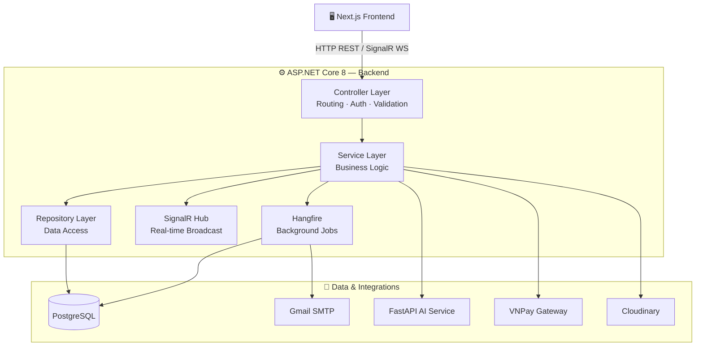
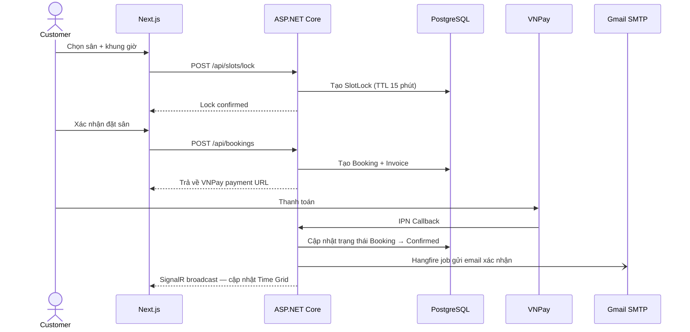
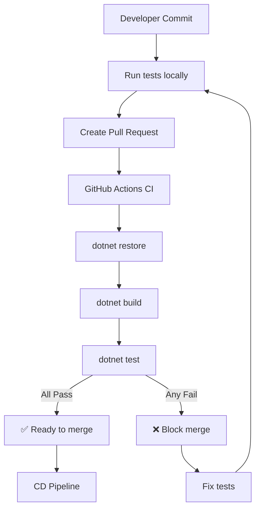
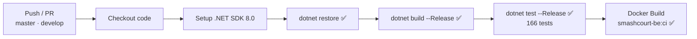

# SmashCourt — Backend (BE) ⚙️

[](https://dotnet.microsoft.com/)
[](https://www.postgresql.org/)
[](https://github.com/NguyenThanhTrung-N2T/SmashCourt-BE/actions)
[](https://github.com/NguyenThanhTrung-N2T/SmashCourt-BE)
[](https://xunit.net/)
[](https://github.com/moq/moq4)
[](https://www.hangfire.io/)
[](https://learn.microsoft.com/aspnet/core/signalr/)
[](https://www.docker.com/)
[](https://opensource.org/licenses/MIT)
[](https://github.com/NguyenThanhTrung-N2T/SmashCourt-BE/actions)

> Hệ thống xử lý nghiệp vụ, cung cấp REST API hiệu năng cao, điều phối tác vụ thời gian thực và quản lý tác vụ nền cho Hệ thống Quản lý và Đặt Sân Cầu Lông **SmashCourt**. Được xây dựng trên nền tảng **ASP.NET Core 8** với kiến trúc phân tầng (Layered Architecture).

---

## 🌐 Hệ sinh thái dự án (Project Ecosystem)

SmashCourt được chia làm **3 phân hệ độc lập**, mỗi phân hệ là một repository riêng để tối ưu hóa khả năng phát triển song song và triển khai độc lập:

| Phân hệ | Công nghệ | Repository |
| :--- | :--- | :--- |
| 🖥️ **Frontend (FE)** | Next.js 16, React 19, TailwindCSS v4 | [SmashCourt-FE](https://github.com/NguyenThanhTrung-N2T/SmashCourt-FE) |
| ⚙️ **Backend (BE)** ← *Bạn đang ở đây* | ASP.NET Core 8, SignalR, Hangfire, PostgreSQL | [SmashCourt-BE](https://github.com/NguyenThanhTrung-N2T/SmashCourt-BE) |
| 🤖 **AI Service** | FastAPI, Python 3.12, Google Gemini API | [SmashCourt-AI](https://github.com/NguyenThanhTrung-N2T/SmashCourt-AI) |

---

## 📌 Giới thiệu (Introduction)

**SmashCourt Backend** là trung tâm điều hành của toàn bộ hệ thống. Phân hệ này chịu trách nhiệm:

- **Xác thực & Phân quyền**: JWT Access Token + Refresh Token rotation, Google OAuth 2.0, xác thực 2 bước qua OTP email.
- **REST API**: Cung cấp toàn bộ API nghiệp vụ cho Frontend thông qua **ASP.NET Core 8 Web API** + **Entity Framework Core** (code-first).
- **Real-time**: Quản lý kết nối WebSocket qua **SignalR Hub** — phát sóng cập nhật trạng thái sân, thông báo hệ thống tức thời đến tất cả client đang kết nối.
- **Background Processing**: Hàng đợi tác vụ nền và lập lịch tự động qua **Hangfire** — gửi email, dọn dẹp booking hết hạn, cập nhật trạng thái khuyến mãi.
- **AI Gateway**: Đóng vai trò proxy an toàn cho mọi yêu cầu AI từ Frontend đến **FastAPI AI Service** — đảm bảo không lộ endpoint AI ra bên ngoài.
- **Third-party Integrations**: VNPay (thanh toán), Cloudinary (lưu trữ ảnh), Gmail SMTP (gửi email).

---

## 🚀 Tính năng cốt lõi (Key Features)

### 1. Quản lý Booking & Chống xung đột (Concurrency Control)

| Tính năng | Mô tả |
| :--- | :--- |
| **Time Grid API** | Trả về trạng thái toàn bộ slot theo chi nhánh, loại sân và ngày. |
| **Slot Lock** | Khóa slot tạm thời (có TTL) khi khách đang trong quá trình thanh toán — ngăn double-booking. |
| **Slot Interest** | Khách đăng ký theo dõi slot, hệ thống tự động thông báo khi slot đó được giải phóng. |
| **Booking Pipeline** | Tính giá tự động: giá sân + dịch vụ + loyalty discount + promotion — validate đồng bộ toàn bộ điều kiện. |

### 2. Tác vụ nền tự động (Hangfire Jobs)

| Job Type | Tác vụ | Trigger |
| :--- | :--- | :--- |
| Fire-and-forget | Gửi email xác nhận booking | Khi booking được tạo |
| Fire-and-forget | Gửi email hủy booking & thông báo hoàn tiền | Khi booking bị hủy |
| Recurring | Tự động hủy booking chưa thanh toán quá 15 phút | Mỗi 5 phút |
| Recurring | Cập nhật trạng thái khuyến mãi hết hạn/hết lượt | Mỗi giờ |
| Recurring | Dọn dẹp OTP code và Slot Lock hết hạn | Mỗi ngày |

### 3. Tích hợp dịch vụ bên thứ ba

| Dịch vụ | Mục đích |
| :--- | :--- |
| **VNPay** | Tạo link thanh toán, xử lý Return URL & IPN callback, ghi log đối soát |
| **Google OAuth 2.0** | Đăng nhập bằng tài khoản Google |
| **Cloudinary** | Upload và lưu trữ ảnh chi nhánh, sân, avatar người dùng |
| **Gmail SMTP** | Gửi email OTP, xác nhận booking, thông báo hủy |
| **FastAPI AI Service** | Proxy toàn bộ yêu cầu AI (chatbot, gợi ý, analytics) |

---

## 📐 Kiến trúc tổng quan (Overall Architecture)

### Phân tầng hệ thống



### Luồng xử lý Booking (Sequence)



---

## 🛠️ Hướng dẫn cài đặt (Installation)

### Yêu cầu hệ thống (Prerequisites)

| Công cụ | Phiên bản tối thiểu | Ghi chú |
| :--- | :--- | :--- |
| [.NET SDK](https://dotnet.microsoft.com/download) | `8.0` trở lên | Bắt buộc |
| [PostgreSQL](https://www.postgresql.org/) | `15+` | Cơ sở dữ liệu chính |
| [Git](https://git-scm.com/) | Bất kỳ | Để clone dự án |
| [Docker](https://www.docker.com/) | Bất kỳ | Tùy chọn — để chạy container |

### Clone và cài đặt

```bash
# 1. Clone repository
git clone https://github.com/NguyenThanhTrung-N2T/SmashCourt-BE.git

# 2. Di chuyển vào thư mục dự án
cd SmashCourt-BE

# 3. Khôi phục các gói NuGet
dotnet restore
```

---

## ▶️ Khởi chạy dự án (Running the Project)

### Development Server (Local)

```bash
dotnet run
```

Sau khi khởi động, các endpoint có sẵn:

| Endpoint | Mô tả |
| :--- | :--- |
| `http://localhost:5000/swagger` | Swagger UI — Tài liệu & kiểm thử API tương tác |
| `http://localhost:5000/hangfire` | Hangfire Dashboard — Theo dõi và quản lý background jobs |
| `ws://localhost:5000/hubs/...` | SignalR Hub endpoint |

### Áp dụng Database Migrations

```bash
# Cập nhật database lên schema mới nhất
dotnet ef database update

# Tạo migration mới (khi thay đổi model)
dotnet ef migrations add MigrationName
```

### Khởi chạy với Docker Compose

```bash
docker compose up -d --build
```

> 💡 File `docker-compose.yml` bao gồm cấu hình **ngrok** (dạng comment) để expose API ra internet — hữu ích khi cần test VNPay IPN Callback hoặc Google OAuth redirect từ môi trường local.

---

## ⚙️ Cấu hình môi trường (Env Configuration)

```bash
# Sao chép file mẫu
cp .env.example .env
```

Sau đó điền các giá trị thực vào file `.env`:

```env
# ── ASP.NET Core ──────────────────────────────────
ASPNETCORE_ENVIRONMENT=Development

# ── Database ──────────────────────────────────────
ConnectionStrings__DefaultConnection=Host=localhost;Port=5432;Database=smashcourt;Username=postgres;Password=your_password

# ── JWT Authentication ────────────────────────────
Jwt__SecretKey=your_super_secret_key_at_least_32_chars
Jwt__Issuer=SmashCourt
Jwt__Audience=SmashCourtUsers

# ── Google OAuth ──────────────────────────────────
Google__ClientId=your_google_client_id
Google__ClientSecret=your_google_client_secret

# ── VNPay ─────────────────────────────────────────
VNPay__TmnCode=YOUR_TMNCODE
VNPay__HashSecret=your_hash_secret
VNPay__BaseUrl=https://sandbox.vnpayment.vn/paymentv2/vpcpay.html

# ── Cloudinary ────────────────────────────────────
Cloudinary__CloudName=your_cloud_name
Cloudinary__ApiKey=your_api_key
Cloudinary__ApiSecret=your_api_secret

# ── Gmail SMTP ────────────────────────────────────
Smtp__Host=smtp.gmail.com
Smtp__Port=587
Smtp__Username=your_email@gmail.com
Smtp__Password=your_app_password

# ── AI Service ────────────────────────────────────
AIService__BaseUrl=http://localhost:8000
```

Bảng tóm tắt các biến quan trọng:

| Biến | Bắt buộc | Mô tả |
| :--- | :---: | :--- |
| `ConnectionStrings__DefaultConnection` | ✅ | Chuỗi kết nối PostgreSQL |
| `Jwt__SecretKey` | ✅ | Khóa bí mật ký JWT (tối thiểu 32 ký tự) |
| `VNPay__TmnCode` & `HashSecret` | ✅ (production) | Thông tin merchant VNPay |
| `Google__ClientId` & `ClientSecret` | ✅ (OAuth) | Thông tin ứng dụng Google Cloud Console |
| `Cloudinary__*` | ✅ | Thông tin tài khoản Cloudinary |
| `AIService__BaseUrl` | ✅ | URL kết nối đến FastAPI AI Service |

---

## 📂 Cấu trúc thư mục (Folder Structure)

```
SmashCourt-BE/
│
├── Controllers/               # API Controllers — Routing & HTTP endpoints
│   ├── AuthController.cs
│   ├── BookingController.cs
│   ├── PaymentController.cs
│   └── ...
│
├── Services/                  # Business Logic Layer
│   ├── BookingService.cs
│   ├── PaymentService.cs
│   ├── LoyaltyService.cs
│   └── ...
│
├── Repositories/              # Data Access Layer — EF Core queries
│
├── Models/                    # Database Entities (EF Core code-first)
│
├── DTOs/                      # Data Transfer Objects — Request/Response shapes
│
├── Data/                      # DbContext, Model Configurations, Seeders
│
├── Migrations/                # EF Core Database Migrations history
│
├── Hubs/                      # SignalR Hubs — Real-time WebSocket endpoints
│   └── BookingHub.cs
│
├── Jobs/                      # Hangfire Job definitions
│   ├── EmailJob.cs
│   ├── BookingCleanupJob.cs
│   └── PromotionSyncJob.cs
│
├── Integrations/              # Third-party service clients
│   ├── VNPayService.cs
│   ├── CloudinaryService.cs
│   └── SmtpService.cs
│
├── Middlewares/               # Custom Middleware (Error handling, Rate limiting)
│
├── Infrastructure/            # JWT config, Auth policies, Logging setup
│
├── Configurations/            # Options classes (strongly-typed config)
│
├── Helpers/                   # Extension methods, utility functions
│
├── Templates/                 # Email HTML templates
│
├── Program.cs                 # App entry point — DI registration & middleware pipeline
├── appsettings.json           # Base configuration
├── appsettings.Development.json
├── SmashCourt-BE.csproj       # Project file & NuGet dependencies
├── Dockerfile                 # Multi-stage Docker build
└── docker-compose.yml         # Docker Compose (API + ngrok optional)
```

---

## 🧪 Test Suite & Quality Assurance

### Tổng quan (Overview)

SmashCourt Backend được bảo vệ bởi một **test suite toàn diện** với **166 unit tests** sử dụng **xUnit** và **Moq**, đạt **~85% coverage** trên các module nghiệp vụ cốt lõi.

```
📊 Test Statistics:
├── Total Tests: 166
├── Pass Rate: 100% (166/166)
├── Coverage: ~85% (critical paths)
└── Framework: xUnit + Moq + FluentAssertions
```

### Phạm vi kiểm thử (Test Coverage)

#### Coverage by Module

```
┌─────────────────────────────────────────────────────────────────┐
│ Module Coverage Breakdown                                       │
├─────────────────────────────────────────────────────────────────┤
│                                                                 │
│ BookingService       ████████████████░░░░░ 78% (41 tests)      │
│ PaymentService       ██████████████████░░░ 90% (12 tests)      │
│ AuthService          ████████████░░░░░░░░░ 60% (14 tests)      │
│ PromotionEngine      █████████████████░░░░ 85% (9 tests)       │
│ LoyaltyService       ████████████████░░░░░ 80% (4 tests)       │
│ Helpers & Utils      ███████████████████░░ 95% (86 tests)      │
│                                                                 │
│ Overall System       █████████████████░░░░ 85%                 │
│                                                                 │
└─────────────────────────────────────────────────────────────────┘
```

#### Detailed Coverage Matrix

| Module | Tests | Coverage | Status |
| :--- | ---: | ---: | :---: |
| **BookingService** | 41 tests | 78% | ✅ Production-ready |
| **PaymentService** | 12 tests | 90% | ✅ Production-ready |
| **AuthService** | 14 tests | 60% | ✅ Core flows covered |
| **PromotionEngineService** | 9 tests | 85% | ✅ Business rules verified |
| **LoyaltyService** | 4 tests | 80% | ✅ Tier logic tested |
| **Helpers & DTOs** | 86 tests | 95% | ✅ Comprehensive |

### Các luồng nghiệp vụ đã được kiểm thử (Tested Business Flows)

#### 🎯 Key Achievements

```
✅ Critical Payment Flows      → 100% covered (VNPay integration)
✅ Booking Lifecycle           → 90% covered (create → checkout → cancel)
✅ Concurrency Safety          → Verified (atomic operations, slot locks)
✅ Financial Security          → Hardened (double charge prevention, amount validation)
✅ Business Rules              → Validated (promotion, loyalty, refund policies)
```

#### ✅ Booking Management (41 tests)
- **Đặt sân online/walk-in**: Validation, pricing, slot lock, concurrency control
- **Checkout**: UNPAID/PARTIALLY_PAID/PAID flows, multiple courts batch update
- **Check-in**: Time window validation, early/late rejection, success flow
- **Cancellation**: Staff/customer cancel, refund calculation, policy enforcement
- **Service management**: Add/remove services, atomic quantity increment, invoice recalculation
- **Guard clauses**: Status validation, branch access, double-checkout prevention

#### ✅ Payment Processing (12 tests)
- **VNPay Integration**: IPN signature validation, success/failure/duplicate handling
- **Payment retry**: Ownership validation, expiry check, old payment voiding
- **Return URL**: Success/cancelled/invalid signature flows
- **Security**: Amount mismatch detection, tampering prevention
- **Idempotency**: Duplicate IPN handling, no double-processing

#### ✅ Loyalty System (4 tests)
- **Points earning**: Checkout completion → points calculation → tier upgrade
- **Atomic operations**: Concurrent booking points increment
- **Transaction audit**: EARN type logging with full context
- **Tier management**: Automatic upgrade when crossing threshold

#### ✅ Authentication & Authorization (14 tests)
- **Login flows**: Password validation, account locking, 2FA initiation
- **Token management**: Refresh token validation, expiry handling
- **Security guards**: MustChangePassword priority, OTP attempt limits
- **OAuth**: Google sign-in validation

#### ✅ Promotion Engine (9 tests)
- **Discount calculation**: Fixed amount, percentage, max cap
- **Validation**: Usage limit, expiry date, conditions
- **Edge cases**: Zero amount, very large numbers, rounding

### Chạy tests (Running Tests)

```bash
# Chạy toàn bộ tests
dotnet test

# Chạy tests với coverage report
dotnet test /p:CollectCoverage=true /p:CoverletOutputFormat=opencover

# Chạy tests cho module cụ thể
dotnet test --filter "FullyQualifiedName~BookingServiceTests"

# Chạy tests với verbosity cao (debug)
dotnet test --logger "console;verbosity=detailed"
```

### Cấu trúc Test Project

```
SmashCourt-BE.Tests/
│
├── Services/                      # Service layer unit tests
│   ├── BookingServiceTests.cs     # 41 tests — Booking nghiệp vụ
│   ├── PaymentServiceTests.cs     # 12 tests — VNPay integration
│   ├── AuthServiceTests.cs        # 14 tests — Authentication flows
│   ├── LoyaltyServiceTests.cs     # 4 tests — Loyalty tier logic
│   └── ...                        # 20+ service test files
│
├── Helpers/                       # Helper & utility tests
│   ├── AppExceptionAssertions.cs  # Custom assertions cho exception testing
│   ├── BookingStatusTransitionTests.cs
│   ├── PromotionHelperTests.cs
│   └── DateAndSecurityHelperTests.cs
│
├── DTOs/                          # DTO validation tests
│   └── BookingDtoValidationTests.cs
│
├── TestData/                      # Test infrastructure
│   ├── TestDataFactory.cs         # Entity factory với smart defaults
│   ├── TestUserFactory.cs         # User/role factory
│   ├── TestConstants.cs           # Shared test constants
│   ├── TestConfigurationFactory.cs
│   └── BookingServiceTestBuilder.cs  # Builder pattern cho complex setup
│
└── SmashCourt-BE.Tests.csproj     # Test project file
```

### Test Quality Standards

Tất cả tests trong dự án tuân thủ các tiêu chuẩn sau:

#### 📏 Naming Convention
```csharp
[Fact]
public async Task {Method}_When{Scenario}_{ExpectedResult}()

// Ví dụ:
CheckoutAsync_WhenInvoiceIsUnpaid_CollectsFullAmountAndMarksInvoicePaid()
AddServiceAsync_WhenStatusChangesDuringTransaction_ThrowsBadRequestWithoutMutation()
```

#### ✅ Comprehensive Verification
```csharp
// 1. Verify result/state
Assert.Equal(expectedStatus, actualStatus);

// 2. Verify side effects (positive)
repository.Verify(x => x.UpdateAsync(entity), Times.Once);

// 3. Verify no unintended side effects (negative)
repository.Verify(x => x.CreateAsync(...), Times.Never);
```

#### 🏗️ Test Infrastructure
- **Builder Pattern**: `BookingServiceTestBuilder` cho setup phức tạp (20+ dependencies)
- **Factory Pattern**: `TestDataFactory` cho entity creation với defaults hợp lý
- **Custom Assertions**: `AppExceptionAssertions` cho exception testing rõ ràng
- **Test Categories**: `[Trait("Category", "Unit")]` cho phân loại tests

#### 🎯 Best Practices Applied

| Practice | Implementation | Benefit |
| :--- | :--- | :--- |
| **AAA Pattern** | Arrange-Act-Assert rõ ràng | Dễ đọc, dễ maintain |
| **Isolation** | Mỗi test độc lập, mock tất cả dependencies | Chạy song song, không side effects |
| **Deterministic** | Không phụ thuộc thời gian/random | Kết quả ổn định, reproducible |
| **Fast Execution** | 166 tests chạy trong ~3 seconds | Developer-friendly, quick feedback |
| **Meaningful Names** | Self-documenting test names | Không cần đọc code để hiểu test |
| **Single Responsibility** | Mỗi test verify 1 behavior | Easy to debug khi fail |

#### 🔒 Security Testing

```csharp
// VNPay signature validation
HandleVnPayIpnAsync_WhenSignatureIsInvalid_LogsAndDoesNotMutateState()

// Amount tampering detection
HandleVnPayIpnAsync_WhenAmountMismatch_RejectsWithoutMutation()

// Ownership validation
CancelByCustomerAsync_WhenDifferentCustomer_ThrowsForbidden()

// Token expiry
RefreshTokenAsync_WhenTokenDoesNotExist_ThrowsTokenInvalidWithoutLoadingUser()
```

#### ⚡ Performance Testing Patterns

```csharp
// Atomic operations (prevent lost updates)
AddServiceAsync_WhenServiceAlreadyExists_IncrementsQuantityAtomically()

// Batch operations (reduce DB round-trips)
CheckoutAsync_WhenBookingHasMultipleCourts_UpdatesAllCourtsToAvailable()

// Early returns (optimization verification)
AddServiceAsync_WhenQuantityIsZero_ThrowsBadRequestBeforeLoadingBooking()
```

--- Continuous Testing Strategy



### Test Coverage Goals & Roadmap

| Priority | Area | Current | Target | Status |
| :---: | :--- | ---: | ---: | :---: |
| 🔴 High | Loyalty deduction on refund | 0% | 100% | 📋 Planned |
| 🔴 High | Promotion + Loyalty stacking | 0% | 100% | 📋 Planned |
| 🟡 Medium | Auth happy paths | 60% | 90% | 📋 Planned |
| 🟡 Medium | VNPay edge cases | 80% | 95% | 📋 Planned |
| 🟢 Low | Integration tests (Testcontainers) | 0% | Core flows | 📋 Future |
| 🟢 Low | Concurrency tests (real DB) | 0% | Critical paths | 📋 Future |

**Target**: 200+ tests với 95%+ coverage trong Q2 2026

---

## ⚡ CI/CD (GitHub Actions)

Pipeline tự động hóa kiểm định chất lượng được định nghĩa trong [`.github/workflows/ci.yml`](https://github.com/NguyenThanhTrung-N2T/SmashCourt-BE/blob/master/.github/workflows/ci.yml):



| Bước | Lệnh | Mục đích | Exit Gate |
| :--- | :--- | :--- | :---: |
| Restore | `dotnet restore` | Khôi phục NuGet packages | Required |
| Build | `dotnet build --configuration Release` | Compile toàn bộ, phát hiện lỗi biên dịch | Required |
| **Test** | `dotnet test --configuration Release` | **Chạy 166 unit tests** | **Must pass 100%** |
| Docker Build | `docker/build-push-action` | Kiểm chứng Dockerfile hợp lệ | Required |

> 🛡️ **Quality Gate**: Pull Request chỉ được merge khi **tất cả 166 tests pass**. Không có exception.

---

## 🤝 Hướng dẫn đóng góp (Contribution Guidelines)

1. **Fork** repository và tạo nhánh từ `develop`:
   ```bash
   git checkout -b feature/your-feature-name
   # hoặc
   git checkout -b fix/bug-description
   ```

2. **Viết code** đảm bảo:
   - Tuân thủ kiến trúc phân tầng — không để business logic trong Controller.
   - **Viết unit test cho mọi Service method mới** (required).
   - Tất cả API endpoint phải có Swagger annotation (`[ProducesResponseType]`).
   - Tuân thủ naming convention: `{Method}_When{Scenario}_{ExpectedResult}`.

3. **Chạy tests trước khi commit**:
   ```bash
   # Chạy toàn bộ tests
   dotnet test
   
   # Verify tất cả tests pass
   # Expected: 166/166 passed (hoặc nhiều hơn nếu bạn thêm tests mới)
   ```

4. **Commit** theo chuẩn [Conventional Commits](https://www.conventionalcommits.org/):
   ```bash
   git commit -m "feat: add slot interest notification via SignalR"
   git commit -m "test: add unit tests for slot interest notification"
   git commit -m "fix: resolve race condition in slot locking"
   ```

5. **Tạo Pull Request** đến `develop` với mô tả đầy đủ:
   - Lý do thay đổi
   - Ảnh hưởng đến hệ thống
   - Cách test (manual + automated)
   - **Screenshots/logs** nếu thay đổi liên quan đến UI/UX
   - **Test coverage** cho code mới

### Test Requirements cho Pull Request

| Loại thay đổi | Test requirement |
| :--- | :--- |
| Thêm Service method mới | ✅ Unit tests cho happy path + edge cases |
| Sửa business logic | ✅ Update existing tests + add regression tests |
| Thêm API endpoint mới | ✅ Unit tests cho service + integration test (optional) |
| Refactor code | ✅ Tất cả existing tests phải pass |
| Bug fix | ✅ Thêm test tái hiện bug trước khi fix |

> 🚫 **Pull Request sẽ bị block** nếu:
> - Có tests failing
> - Thêm code mới mà không có tests
> - Coverage giảm đáng kể (>5%)

---

## 🗺️ Lộ trình phát triển (Roadmap)

### Tính năng chính (Core Features)

| Trạng thái | Tính năng |
| :---: | :--- |
| ✅ Done | Authentication — JWT + Refresh Token rotation + Google OAuth |
| ✅ Done | Booking pipeline — Slot Lock, Slot Interest, double-booking prevention |
| ✅ Done | Hangfire jobs — Email, auto-cancel, promotion sync |
| ✅ Done | VNPay integration — Payment link + IPN callback + refund |
| ✅ Done | SignalR — Real-time Time Grid broadcast |
| ✅ Done | Loyalty Program — điểm tích lũy & tự động nâng/hạ tier |
| ✅ Done | **Unit Test Suite — 166 tests, 85% coverage** |

### Cải tiến đang triển khai (In Progress)

| Trạng thái | Tính năng | Priority | Timeline |
| :---: | :--- | :---: | :--- |
| 🔄 In Progress | Rate Limiting nghiêm ngặt trên tất cả sensitive endpoints | High | Q1 2026 |
| 🔄 In Progress | Loyalty deduction on refund + tier downgrade tests | High | Q1 2026 |
| 🔄 In Progress | Promotion + Loyalty stacking calculation tests | High | Q1 2026 |

### Kế hoạch phát triển (Planned)

| Trạng thái | Tính năng | Priority | Timeline |
| :---: | :--- | :---: | :--- |
| 📋 Planned | Tích hợp Serilog + Seq cho centralized logging | Medium | Q2 2026 |
| 📋 Planned | Integration tests với Testcontainers (PostgreSQL) | Medium | Q2 2026 |
| 📋 Planned | Concurrency tests với real database | Medium | Q2 2026 |
| 📋 Planned | Subscription booking — đặt sân định kỳ theo tháng | Low | Q3 2026 |
| 📋 Planned | Tự động test load với NBomber | Low | Q3 2026 |
| 📋 Planned | Redis caching layer cho high-traffic endpoints | Low | Q4 2026 |

### Test Coverage Roadmap

| Milestone | Target Coverage | Timeline |
| :--- | ---: | :--- |
| ✅ **Current State** | **~85%** (166 tests) | ✅ Done |
| 🎯 Phase 1: Loyalty & Promotion | ~88% (+12 tests) | Q1 2026 |
| 🎯 Phase 2: VNPay & Auth | ~92% (+15 tests) | Q1 2026 |
| 🎯 Phase 3: Integration Tests | ~95% (+10 tests) | Q2 2026 |
| 🎯 Phase 4: Concurrency & Resilience | ~97% (+8 tests) | Q2 2026 |

---

## 📄 Giấy phép (License)

Phát hành dưới giấy phép **MIT License** — cho phép tự do sử dụng, sao chép, sửa đổi và phân phối cho cả mục đích cá nhân lẫn thương mại.

```text
MIT License

Copyright (c) 2026 Nguyen Thanh Trung — SmashCourt

Permission is hereby granted, free of charge, to any person obtaining a copy
of this software and associated documentation files (the "Software"), to deal
in the Software without restriction, including without limitation the rights
to use, copy, modify, merge, publish, distribute, sublicense, and/or sell
copies of the Software, and to permit persons to whom the Software is
furnished to do so, subject to the following conditions:

The above copyright notice and this permission notice shall be included in all
copies or substantial portions of the Software.

THE SOFTWARE IS PROVIDED "AS IS", WITHOUT WARRANTY OF ANY KIND, EXPRESS OR
IMPLIED, INCLUDING BUT NOT LIMITED TO THE WARRANTIES OF MERCHANTABILITY,
FITNESS FOR A PARTICULAR PURPOSE AND NONINFRINGEMENT.
```

Xem file [`LICENSE`](./LICENSE) hoặc tại [opensource.org/licenses/MIT](https://opensource.org/licenses/MIT).
