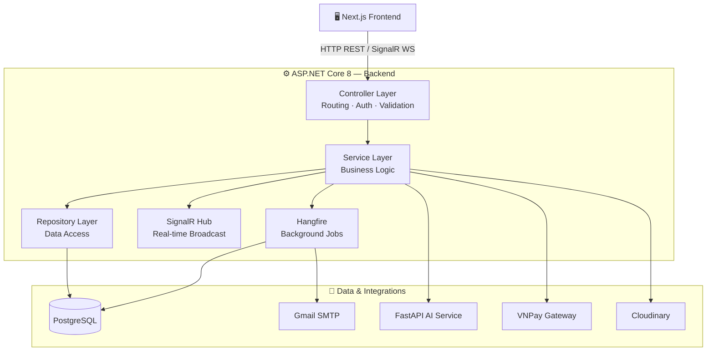
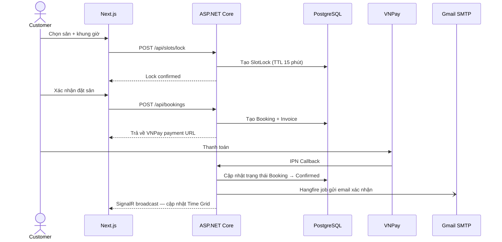
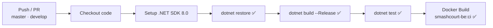

# SmashCourt — Backend (BE) ⚙️

[](https://dotnet.microsoft.com/)
[](https://www.postgresql.org/)
[](https://www.hangfire.io/)
[](https://learn.microsoft.com/aspnet/core/signalr/)
[](https://www.docker.com/)
[](https://opensource.org/licenses/MIT)
[](https://github.com/NguyenThanhTrung-N2T/SmashCourt-BE/actions)

> Hệ thống xử lý nghiệp vụ, cung cấp REST API hiệu năng cao, điều phối tác vụ thời gian thực và quản lý tác vụ nền cho Hệ thống Quản lý và Đặt Sân Cầu Lông **SmashCourt**. Được xây dựng trên nền tảng **ASP.NET Core 8** với kiến trúc phân tầng (Layered Architecture).

---

## 🌐 Hệ sinh thái dự án (Project Ecosystem)

SmashCourt được chia làm **3 phân hệ độc lập**, mỗi phân hệ là một repository riêng để tối ưu hóa khả năng phát triển song song và triển khai độc lập:

| Phân hệ | Công nghệ | Repository |
| :--- | :--- | :--- |
| 🖥️ **Frontend (FE)** | Next.js 16, React 19, TailwindCSS v4 | [SmashCourt-FE](https://github.com/NguyenThanhTrung-N2T/SmashCourt-FE) |
| ⚙️ **Backend (BE)** ← *Bạn đang ở đây* | ASP.NET Core 8, SignalR, Hangfire, PostgreSQL | [SmashCourt-BE](https://github.com/NguyenThanhTrung-N2T/SmashCourt-BE) |
| 🤖 **AI Service** | FastAPI, Python 3.12, Google Gemini API | [SmashCourt-AI](https://github.com/NguyenThanhTrung-N2T/SmashCourt-AI) |

---

## 📌 Giới thiệu (Introduction)

**SmashCourt Backend** là trung tâm điều hành của toàn bộ hệ thống. Phân hệ này chịu trách nhiệm:

- **Xác thực & Phân quyền**: JWT Access Token + Refresh Token rotation, Google OAuth 2.0, xác thực 2 bước qua OTP email.
- **REST API**: Cung cấp toàn bộ API nghiệp vụ cho Frontend thông qua **ASP.NET Core 8 Web API** + **Entity Framework Core** (code-first).
- **Real-time**: Quản lý kết nối WebSocket qua **SignalR Hub** — phát sóng cập nhật trạng thái sân, thông báo hệ thống tức thời đến tất cả client đang kết nối.
- **Background Processing**: Hàng đợi tác vụ nền và lập lịch tự động qua **Hangfire** — gửi email, dọn dẹp booking hết hạn, cập nhật trạng thái khuyến mãi.
- **AI Gateway**: Đóng vai trò proxy an toàn cho mọi yêu cầu AI từ Frontend đến **FastAPI AI Service** — đảm bảo không lộ endpoint AI ra bên ngoài.
- **Third-party Integrations**: VNPay (thanh toán), Cloudinary (lưu trữ ảnh), Gmail SMTP (gửi email).

---

## 🚀 Tính năng cốt lõi (Key Features)

### 1. Quản lý Booking & Chống xung đột (Concurrency Control)

| Tính năng | Mô tả |
| :--- | :--- |
| **Time Grid API** | Trả về trạng thái toàn bộ slot theo chi nhánh, loại sân và ngày. |
| **Slot Lock** | Khóa slot tạm thời (có TTL) khi khách đang trong quá trình thanh toán — ngăn double-booking. |
| **Slot Interest** | Khách đăng ký theo dõi slot, hệ thống tự động thông báo khi slot đó được giải phóng. |
| **Booking Pipeline** | Tính giá tự động: giá sân + dịch vụ + loyalty discount + promotion — validate đồng bộ toàn bộ điều kiện. |

### 2. Tác vụ nền tự động (Hangfire Jobs)

| Job Type | Tác vụ | Trigger |
| :--- | :--- | :--- |
| Fire-and-forget | Gửi email xác nhận booking | Khi booking được tạo |
| Fire-and-forget | Gửi email hủy booking & thông báo hoàn tiền | Khi booking bị hủy |
| Recurring | Tự động hủy booking chưa thanh toán quá 15 phút | Mỗi 5 phút |
| Recurring | Cập nhật trạng thái khuyến mãi hết hạn/hết lượt | Mỗi giờ |
| Recurring | Dọn dẹp OTP code và Slot Lock hết hạn | Mỗi ngày |

### 3. Tích hợp dịch vụ bên thứ ba

| Dịch vụ | Mục đích |
| :--- | :--- |
| **VNPay** | Tạo link thanh toán, xử lý Return URL & IPN callback, ghi log đối soát |
| **Google OAuth 2.0** | Đăng nhập bằng tài khoản Google |
| **Cloudinary** | Upload và lưu trữ ảnh chi nhánh, sân, avatar người dùng |
| **Gmail SMTP** | Gửi email OTP, xác nhận booking, thông báo hủy |
| **FastAPI AI Service** | Proxy toàn bộ yêu cầu AI (chatbot, gợi ý, analytics) |

---

## 📐 Kiến trúc tổng quan (Overall Architecture)

### Phân tầng hệ thống



### Luồng xử lý Booking (Sequence)



---

## 🛠️ Hướng dẫn cài đặt (Installation)

### Yêu cầu hệ thống (Prerequisites)

| Công cụ | Phiên bản tối thiểu | Ghi chú |
| :--- | :--- | :--- |
| [.NET SDK](https://dotnet.microsoft.com/download) | `8.0` trở lên | Bắt buộc |
| [PostgreSQL](https://www.postgresql.org/) | `15+` | Cơ sở dữ liệu chính |
| [Git](https://git-scm.com/) | Bất kỳ | Để clone dự án |
| [Docker](https://www.docker.com/) | Bất kỳ | Tùy chọn — để chạy container |

### Clone và cài đặt

```bash
# 1. Clone repository
git clone https://github.com/NguyenThanhTrung-N2T/SmashCourt-BE.git

# 2. Di chuyển vào thư mục dự án
cd SmashCourt-BE

# 3. Khôi phục các gói NuGet
dotnet restore
```

---

## ▶️ Khởi chạy dự án (Running the Project)

### Development Server (Local)

```bash
dotnet run
```

Sau khi khởi động, các endpoint có sẵn:

| Endpoint | Mô tả |
| :--- | :--- |
| `http://localhost:5000/swagger` | Swagger UI — Tài liệu & kiểm thử API tương tác |
| `http://localhost:5000/hangfire` | Hangfire Dashboard — Theo dõi và quản lý background jobs |
| `ws://localhost:5000/hubs/...` | SignalR Hub endpoint |

### Áp dụng Database Migrations

```bash
# Cập nhật database lên schema mới nhất
dotnet ef database update

# Tạo migration mới (khi thay đổi model)
dotnet ef migrations add MigrationName
```

### Khởi chạy với Docker Compose

```bash
docker compose up -d --build
```

> 💡 File `docker-compose.yml` bao gồm cấu hình **ngrok** (dạng comment) để expose API ra internet — hữu ích khi cần test VNPay IPN Callback hoặc Google OAuth redirect từ môi trường local.

---

## ⚙️ Cấu hình môi trường (Env Configuration)

```bash
# Sao chép file mẫu
cp .env.example .env
```

Sau đó điền các giá trị thực vào file `.env`:

```env
# ── ASP.NET Core ──────────────────────────────────
ASPNETCORE_ENVIRONMENT=Development

# ── Database ──────────────────────────────────────
ConnectionStrings__DefaultConnection=Host=localhost;Port=5432;Database=smashcourt;Username=postgres;Password=your_password

# ── JWT Authentication ────────────────────────────
Jwt__SecretKey=your_super_secret_key_at_least_32_chars
Jwt__Issuer=SmashCourt
Jwt__Audience=SmashCourtUsers

# ── Google OAuth ──────────────────────────────────
Google__ClientId=your_google_client_id
Google__ClientSecret=your_google_client_secret

# ── VNPay ─────────────────────────────────────────
VNPay__TmnCode=YOUR_TMNCODE
VNPay__HashSecret=your_hash_secret
VNPay__BaseUrl=https://sandbox.vnpayment.vn/paymentv2/vpcpay.html

# ── Cloudinary ────────────────────────────────────
Cloudinary__CloudName=your_cloud_name
Cloudinary__ApiKey=your_api_key
Cloudinary__ApiSecret=your_api_secret

# ── Gmail SMTP ────────────────────────────────────
Smtp__Host=smtp.gmail.com
Smtp__Port=587
Smtp__Username=your_email@gmail.com
Smtp__Password=your_app_password

# ── AI Service ────────────────────────────────────
AIService__BaseUrl=http://localhost:8000
```

Bảng tóm tắt các biến quan trọng:

| Biến | Bắt buộc | Mô tả |
| :--- | :---: | :--- |
| `ConnectionStrings__DefaultConnection` | ✅ | Chuỗi kết nối PostgreSQL |
| `Jwt__SecretKey` | ✅ | Khóa bí mật ký JWT (tối thiểu 32 ký tự) |
| `VNPay__TmnCode` & `HashSecret` | ✅ (production) | Thông tin merchant VNPay |
| `Google__ClientId` & `ClientSecret` | ✅ (OAuth) | Thông tin ứng dụng Google Cloud Console |
| `Cloudinary__*` | ✅ | Thông tin tài khoản Cloudinary |
| `AIService__BaseUrl` | ✅ | URL kết nối đến FastAPI AI Service |

---

## 📂 Cấu trúc thư mục (Folder Structure)

```
SmashCourt-BE/
│
├── Controllers/               # API Controllers — Routing & HTTP endpoints
│   ├── AuthController.cs
│   ├── BookingController.cs
│   ├── PaymentController.cs
│   └── ...
│
├── Services/                  # Business Logic Layer
│   ├── BookingService.cs
│   ├── PaymentService.cs
│   ├── LoyaltyService.cs
│   └── ...
│
├── Repositories/              # Data Access Layer — EF Core queries
│
├── Models/                    # Database Entities (EF Core code-first)
│
├── DTOs/                      # Data Transfer Objects — Request/Response shapes
│
├── Data/                      # DbContext, Model Configurations, Seeders
│
├── Migrations/                # EF Core Database Migrations history
│
├── Hubs/                      # SignalR Hubs — Real-time WebSocket endpoints
│   └── BookingHub.cs
│
├── Jobs/                      # Hangfire Job definitions
│   ├── EmailJob.cs
│   ├── BookingCleanupJob.cs
│   └── PromotionSyncJob.cs
│
├── Integrations/              # Third-party service clients
│   ├── VNPayService.cs
│   ├── CloudinaryService.cs
│   └── SmtpService.cs
│
├── Middlewares/               # Custom Middleware (Error handling, Rate limiting)
│
├── Infrastructure/            # JWT config, Auth policies, Logging setup
│
├── Configurations/            # Options classes (strongly-typed config)
│
├── Helpers/                   # Extension methods, utility functions
│
├── Templates/                 # Email HTML templates
│
├── Program.cs                 # App entry point — DI registration & middleware pipeline
├── appsettings.json           # Base configuration
├── appsettings.Development.json
├── SmashCourt-BE.csproj       # Project file & NuGet dependencies
├── Dockerfile                 # Multi-stage Docker build
└── docker-compose.yml         # Docker Compose (API + ngrok optional)
```

---

## ⚡ CI/CD (GitHub Actions)

Pipeline tự động hóa kiểm định chất lượng được định nghĩa trong [`.github/workflows/ci.yml`](https://github.com/NguyenThanhTrung-N2T/SmashCourt-BE/blob/master/.github/workflows/ci.yml):



| Bước | Lệnh | Mục đích |
| :--- | :--- | :--- |
| Restore | `dotnet restore` | Khôi phục NuGet packages |
| Build | `dotnet build --configuration Release` | Compile toàn bộ, phát hiện lỗi biên dịch |
| Test | `dotnet test --configuration Release` | Chạy toàn bộ unit tests |
| Docker Build | `docker/build-push-action` | Kiểm chứng Dockerfile hợp lệ |

---

## 🤝 Hướng dẫn đóng góp (Contribution Guidelines)

1. **Fork** repository và tạo nhánh từ `develop`:
   ```bash
   git checkout -b feature/your-feature-name
   # hoặc
   git checkout -b fix/bug-description
   ```
2. **Viết code** đảm bảo:
   - Tuân thủ kiến trúc phân tầng — không để business logic trong Controller.
   - Viết unit test cho các Service mới.
   - Tất cả API endpoint phải có Swagger annotation (`[ProducesResponseType]`).
3. **Commit** theo chuẩn [Conventional Commits](https://www.conventionalcommits.org/):
   ```bash
   git commit -m "feat: add slot interest notification via SignalR"
   git commit -m "fix: resolve race condition in slot locking"
   ```
4. **Tạo Pull Request** đến `develop` với mô tả đầy đủ — lý do thay đổi, ảnh hưởng, cách test.

---

## 🗺️ Lộ trình phát triển (Roadmap)

| Trạng thái | Tính năng |
| :---: | :--- |
| ✅ Done | Authentication — JWT + Refresh Token rotation + Google OAuth |
| ✅ Done | Booking pipeline — Slot Lock, Slot Interest, double-booking prevention |
| ✅ Done | Hangfire jobs — Email, auto-cancel, promotion sync |
| ✅ Done | VNPay integration — Payment link + IPN callback + refund |
| ✅ Done | SignalR — Real-time Time Grid broadcast |
| ✅ Done | Loyalty Program — điểm tích lũy & tự động nâng/hạ tier |
| 🔄 In Progress | Rate Limiting nghiêm ngặt trên tất cả sensitive endpoints |
| 📋 Planned | Tích hợp Serilog + Seq cho centralized logging |
| 📋 Planned | Subscription booking — đặt sân định kỳ theo tháng |
| 📋 Planned | Tự động test load với NBomber |

---

## 📄 Giấy phép (License)

Phát hành dưới giấy phép **MIT License** — cho phép tự do sử dụng, sao chép, sửa đổi và phân phối cho cả mục đích cá nhân lẫn thương mại.

```text
MIT License

Copyright (c) 2026 Nguyen Thanh Trung — SmashCourt

Permission is hereby granted, free of charge, to any person obtaining a copy
of this software and associated documentation files (the "Software"), to deal
in the Software without restriction, including without limitation the rights
to use, copy, modify, merge, publish, distribute, sublicense, and/or sell
copies of the Software, and to permit persons to whom the Software is
furnished to do so, subject to the following conditions:

The above copyright notice and this permission notice shall be included in all
copies or substantial portions of the Software.

THE SOFTWARE IS PROVIDED "AS IS", WITHOUT WARRANTY OF ANY KIND, EXPRESS OR
IMPLIED, INCLUDING BUT NOT LIMITED TO THE WARRANTIES OF MERCHANTABILITY,
FITNESS FOR A PARTICULAR PURPOSE AND NONINFRINGEMENT.
```

Xem file [`LICENSE`](./LICENSE) hoặc tại [opensource.org/licenses/MIT](https://opensource.org/licenses/MIT).
